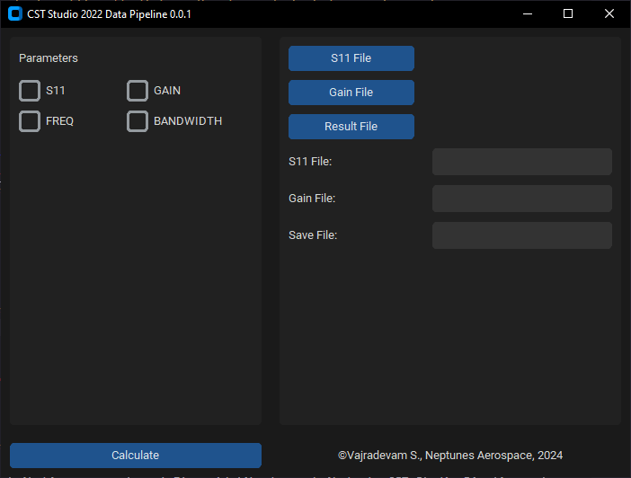

# CST Studio Pipeline

CST Studio Pipeline is a Python program designed to extract and process data from various sources efficiently. It provides a flexible and customizable pipeline for data extraction tasks.

## Installation

Clone the repository using Git:

```bash
$ git clone https://github.com/brushwayne/cst_studio-pipeline.git
```

Create a virtual environment

```bash
$ python -m venv VENV
```

Activate the virtual environment depending on your Operating System then install the required dependencies:

```bash
$ pip install -r requirements.txt
```

Alternatively, You can download the latest executable from [here](https://github.com/brushwayne/cst_studio-pipeline/releases/tag/v0.1.2).
## Running 

```bash
$ cd cst_studio-pipeline
$ python main.py
```

## Usage

Follow the instructions and configure the pipeline according to your data extraction requirements.



1. Check the parameters which you want to extract.
2. Click on `S11 File` to select the output of your exported ASCII S11 file.
3. Click on `Gain File` to select the output of your exported ASCII Gain file.
4. Click on `Result File` to specify the output file _(ideally a `.csv` empty file)_.
5. Click calculate to start the process and wait to finish.

## Contributing

Contributions are welcome! If you'd like to contribute to CST Studio Pipeline, please fork the repository and submit a pull request with your changes. For licensing, read [LICENSE](LICENSE).
